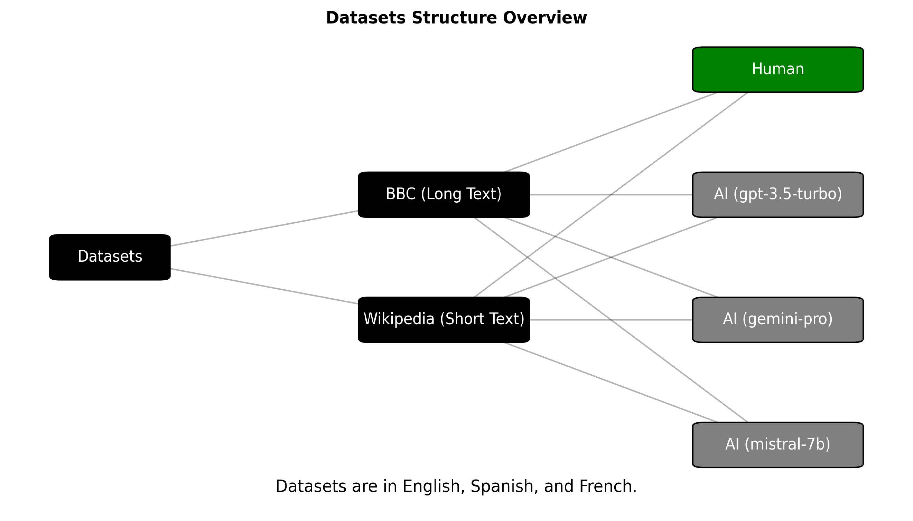

# AI‑Generated Text Detection Across Models and Languages

This repository contains the code and supplementary materials for the Master's thesis **“Detection of AI‑Generated Text Across Models and Languages.”**  The goal of the project is to develop robust methods for distinguishing between human‑authored and machine‑generated text in multiple languages.  While most prior work focuses solely on English, this project expands the scope to **English, Spanish and French**.

## Thesis overview

Modern language models such as GPT‑3.5, Mistral 7B and Google’s Gemini Pro can generate fluent text that is difficult to distinguish from human writing.  To enable reliable detection across languages and generation models, we:

  

1. **Collected a balanced corpus** of 24 000 texts.  Human documents were drawn from reputable sources such as **Wikipedia** and **BBC News**, while AI‑generated documents were created using **GPT‑3.5‑Turbo‑0125**, **Mistral 7B** and **Gemini Pro** via two prompt styles:
   * **Topic:** generate text based on a given title and domain (e.g., Wikipedia or BBC).
   * **Continue:** generate text by continuing the first few sentences of a human document.
2. **Analysed linguistic differences** between human and AI texts, exploring readability metrics, lexical diversity, syntactic complexity and repetitiveness.
3. **Trained detection models** using the multilingual transformer **XLM‑RoBERTa**.  We evaluated the system with three experimental setups:
   * *Cross‑model:* train on AI text from one model and test on another within the same language.
   * *Cross‑lingual:* train on one language and test on another.
   * *Multi‑model multi‑lingual:* combine all languages and models for training.
4. **Achieved high accuracy and F1 scores** across all setups.  The XLM‑RoBERTa model generalised well to unseen languages and generation models, demonstrating the feasibility of multi‑lingual AI‑text detection.

If you would like to read the full thesis, a PDF is provided in the repository (`32801688‑AmirMohammadi‑RezaHaffari‑TrangVu‑Thesis.pdf`).

## Repository structure

    ├── Code
    │   ├── 1_Prepare_Dataset       # Scripts/notebooks for human‑text collection and preprocessing
    │   ├── 2_Gen_Ai_Text           # Scripts and notebooks to generate AI‑authored text for each language
    │   │   ├── English/Code        # Python scripts (e.g., Gen_Text_Mistral.py) and notebooks for English
    │   │   ├── Spanish/Code        # Scripts/notebooks for Spanish
    │   │   ├── French/Code         # Scripts/notebooks for French
    │   │   └── Persian/Code        # Additional materials for Persian (not part of the thesis experiments)
    │   ├── 3_Final_Dataset         # Notebooks for compiling the final dataset of 24,000 samples
    │   ├── 4_Feature_Extraction    # Notebooks/scripts for analysing linguistic features and extracting statistics
    │   └── 5_Models
    │       ├── Cross_Lingual_XLM-RoBERTa         # Cross-lingual experiments: train on one language and test on another
    │       ├── Cross_Model_XLM-RoBERTa           # Cross-model experiments: train on one AI generator and test on another
    │       ├── Deepfake_Text_Detect
    │       │   ├── training                      # Training scripts for the XLM‑RoBERTa detection model
    │       │   └── deployment                    # Utilities for deploying a trained model
    │       └── Multi_Model_Multi_Lingual_XLM-RoBERTa # Multi-model multi-lingual experiments and final results
    ├── figures                     # Plots and illustrations used in the thesis
    ├── thesis                      # Thesis PDF and related documents
    └── README.md (this file)

### Key files and folders

| Path | Description |
|------|-------------|
| `Code/2_Gen_Ai_Text/*/Code/Gen_Text_*.py` | Python scripts to generate AI text for different languages and LLMs.  For example, `Gen_Text_Mistral.py` defines functions `generate_ai_text_topic` and `generate_ai_text_continue` to create prompts for Wikipedia/BBC domains and call a Mistral model. |
| `Code/3_Final_Dataset/Nine_Dataset.ipynb` | Notebook that compiles the AI and human texts into the final balanced dataset. |
| `Code/4_Feature_Extraction/*` | Jupyter notebooks and helper scripts to compute linguistic features (e.g., readability, lexical diversity, syntactic complexity, repetitiveness, perplexity, POS distribution and semantic coherence) for each text.  These features were used for exploratory data analysis and may serve as additional inputs to machine‑learning classifiers. |
| `Code/5_Models/Deepfake_Text_Detect/training` | Training pipeline for the XLM‑RoBERTa detector (PyTorch/transformers). |
| `Code/5_Models/Deepfake_Text_Detect/Deepfake_Model.ipynb` | Jupyter notebook demonstrating the end‑to‑end deepfake text detection model, including loading the dataset, fine‑tuning XLM‑RoBERTa and evaluating accuracy/F1. |
| `Code/5_Models/Deepfake_Text_Detect/deployment` | Utilities for preparing evaluation testbeds and deploying the trained model; e.g., `prepare_testbeds.py` loads benchmark datasets and organises them into domain‑specific splits. |
| `Code/5_Models/Cross_Lingual_XLM-RoBERTa` | Scripts and notebooks for cross‑lingual experiments.  Train the detector on one language (e.g., English) and evaluate on another (Spanish or French).  Includes training pipelines and evaluation result files. |
| `Code/5_Models/Cross_Model_XLM-RoBERTa` | Scripts and notebooks for cross‑model experiments.  Train the detector on texts generated by one LLM and test on texts generated by another.  Contains model training code and evaluation results. |
| `Code/5_Models/Multi_Model_Multi_Lingual_XLM-RoBERTa` | Implementation of multi‑model multi‑lingual experiments combining all languages and generators.  This folder includes training scripts, evaluation notebooks and result files (e.g., `multi_model_multi_lingual_evaluation_results.csv`, which reports an accuracy of 0.907 and F1 score of 0.9 for the XLM‑RoBERTa model). |
| `thesis/*.pdf` | Thesis document for reference and citation. |

## Setup

1. **Clone the repository.**  If you only have access to a zip file, extract it to your working directory.
2. **Create a Python environment** (e.g., using `venv` or Conda) with Python 3.10+.
3. **Install dependencies.**  Recommended packages include:

       pip install torch transformers pandas tqdm scikit-learn sentencepiece matplotlib seaborn

   *Note:* Some notebooks also require `jupyter` or `ipykernel` to run inside Jupyter.

4. **Obtain API credentials** for the language models (if necessary).  The scripts assume you have access to the respective APIs or local checkpoints for Gemini Pro, Mistral 7B and GPT‑3.5.  You may need to modify the code to point to local models or your API keys.

## Generating the dataset

1. **Prepare human texts.**  Use the notebooks under `Code/1_Prepare_Dataset` to download and clean articles from the MIRACL Corpus and XL‑Sum dataset.
2. **Generate AI texts.**  Run the scripts in `Code/2_Gen_Ai_Text/<language>/Code` to produce AI‑authored documents.  For example:

       python Code/2_Gen_Ai_Text/English/Code/Gen_Text_Mistral.py \
         --input_csv path/to/english_human_texts.csv \
         --output_csv path/to/english_mistral_generated.csv \
         --model_id mistral-7b --prompt_type Topic

   Each script defines two functions: `generate_ai_text_topic` (generates a new text from a title and domain) and `generate_ai_text_continue` (continues an existing text using a random number of leading words).
3. **Compile the dataset.**  Use `Code/3_Final_Dataset/Nine_Dataset.ipynb` to merge the human and AI texts into a single DataFrame with labels (`human`/`AI`), language, domain and model ID.

## Training the detection model

1. Navigate to the appropriate folder under `Code/5_Models` depending on the experiment you wish to run:
   * `Cross_Lingual_XLM-RoBERTa` – training scripts and notebooks for cross‑lingual experiments (e.g., train on English and test on Spanish/French).
   * `Cross_Model_XLM-RoBERTa` – training scripts and notebooks for cross‑model experiments (train on one LLM’s outputs, test on another’s).
   * `Multi_Model_Multi_Lingual_XLM-RoBERTa` – scripts for training a single detector on the combined multi‑model multi‑lingual dataset.
   * `Deepfake_Text_Detect/training` – baseline experiments using the Deepfake/MAGE architecture.  Inside this folder, there is a `longformer` subfolder containing `main.py` and a simple `train.sh` wrapper for launching training.
2. Each training script loads the relevant dataset, tokenises the text using the **XLM‑RoBERTa tokenizer** (or Longformer for the Deepfake baseline), and trains a classifier using PyTorch.  Adjust hyperparameters (batch size, epochs, learning rate) as needed.  Feel free to explore cross‑model, cross‑lingual and multi‑model multi‑lingual setups as described in the thesis.
3. Evaluate the model on held‑out test sets and report accuracy/F1 scores.  Evaluation results for the multi‑model multi‑lingual experiment are provided in `multi_model_multi_lingual_evaluation_results.csv`.  See the thesis for baseline numbers and ROC curves to compare against.

## Results and future work

Our experiments demonstrate that a multilingual transformer like XLM‑RoBERTa can accurately distinguish human and AI texts across languages and generation models.  The system generalises well in transfer scenarios, suggesting that style‑based differences are consistent across languages.  Future directions include:

* Extending the dataset to additional languages (e.g., German, Italian, Persian).
* Exploring lightweight models for on‑device detection.
* Investigating adversarial robustness, where generation models attempt to evade detectors.

## Baseline comparison: MAGE (formerly DeepFake)

To benchmark our XLM‑RoBERTa detector against other methods, we also evaluated the **MAGE** model (formerly known as DeepFake Text Detection).  MAGE is a machine‑generated text detector originally released by Zhang et al. (2024).  In our thesis, we trained MAGE on the multi‑model multi‑lingual dataset and compared its performance with our own model using the same train/test splits.  The raw evaluation output for our XLM‑RoBERTa system is stored in `multi_model_multi_lingual_evaluation_results.csv`, and analogous results were produced for MAGE.  To reproduce this comparison, clone the MAGE repository (<https://github.com/yafuly/MAGE>) and adapt its training scripts to our dataset.  We modified its `detect` function to support multiple decision‑making approaches, as discussed in the thesis.

## Licensing and citation

This repository is provided for academic use only.  If you use this code or dataset in your work, please cite the thesis and acknowledge the authors.  You may also include a license file of your choice (e.g., MIT or Apache 2.0) to clarify usage rights.
